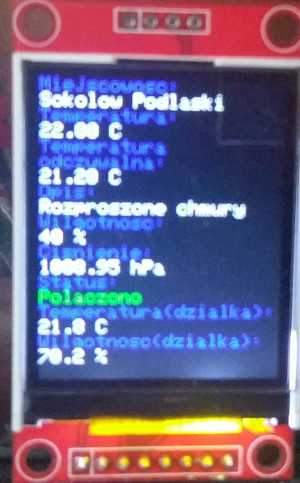

# EspApi
Odczyt danych pogodowych z [weatherbit.io](https://www.weatherbit.io/) oraz danych z [urządzenia](https://github.com/lucjanek/BlynkProject) i wyświetlenie na wyświetlaczu tft.

## Biblioteki
* ESP8266WiFi
* ESP8266HTTPClient
* ArduinoJson

## Komponenty
* NodeMcu ESP8266
* Wyświetlacz TFT 1.8" ST7735

## Zdjęcie

